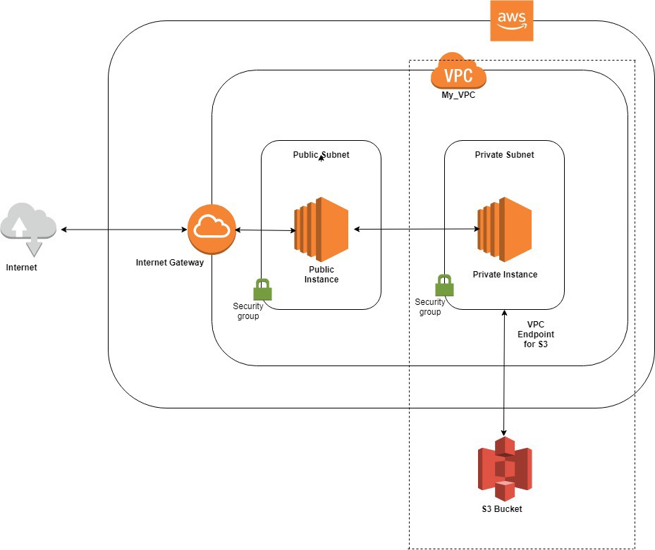
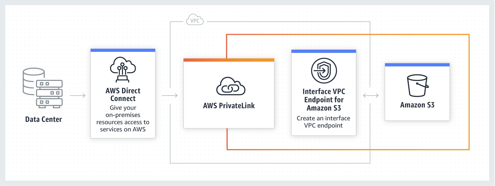
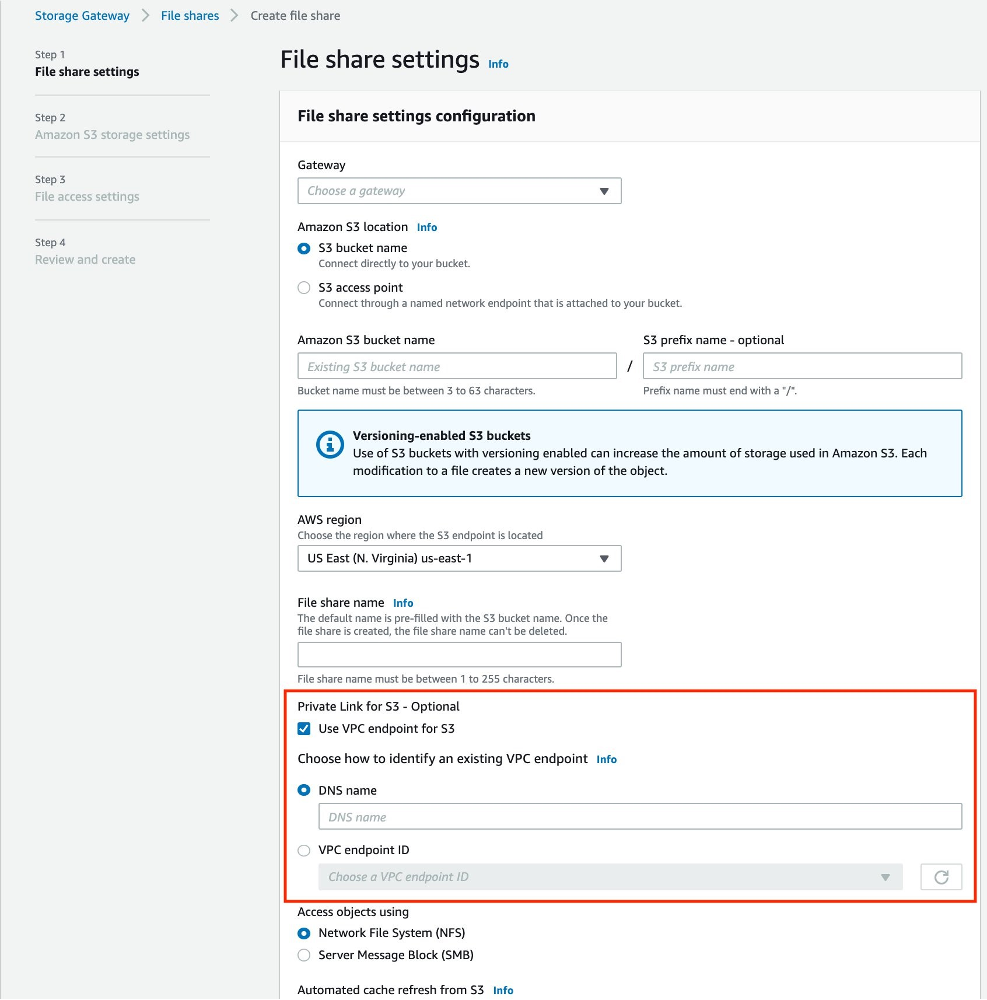
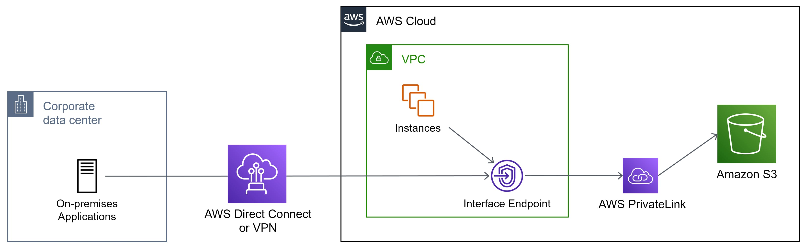
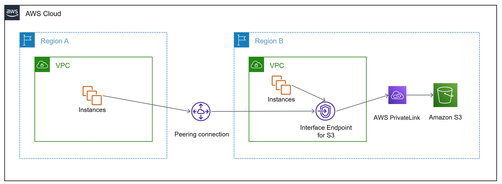
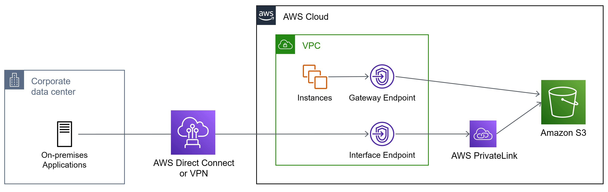
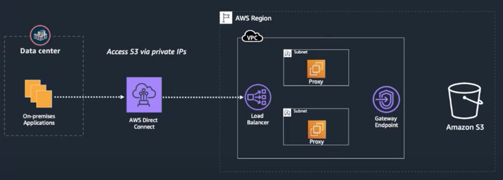

# VPC Endpoint for Amazon S3
The purpose here is to write code in Terraform that will provision an Infrastructure as shown in the Diagram below. It is made up of:

- A VPC that has one private and one public Subnet
  - Only the public Instance has access to Internet. This Instance acts as a jump box to the private instance
  - The private Instance does not have access to Internet. This Instance connects to S3 via a VPC Endpoint
- VPC Endpoint provides private access to S3. Traffic between private Instance and S3:
  - Does not go through open Internet
  - Does not leave Amazon Network



- VPC Endpoint for S3 is a helpful feature that privately connects your VPC to S3. 
- A private connection from your VPC to your AWS services is a much more secure way compared to giving Internet access to your Instances or using a NAT device.

  - [VPC Endpoint for Amazon S3](https://aws.amazon.com/blogs/aws/new-vpc-endpoint-for-amazon-s3/) blog explains how to create an Endpoint via AWS Management Console


# Prerequisites
- Terraform v0.12.3 or higher
- Create an RSA key (i.e. ~/.ssh/id_rsa) for granting access to servers that we will be provisioning in this repository. Use a third-party tool such as [ssh-keygen](https://www.ssh.com/ssh/keygen/) for this purpose
- Make sure that in the Repository where we are going to have the Terraform code that supplies the infra, we have an ssh key added to avoid operating Terraform through https, since then it would need us to provide keys and it would stop the automatic process
- Ensure that AWS Credentials are available at: "~/.aws/credentials" in the following format:
```
      [default]
      aws_access_key_id = <KEY>
      aws_secret_access_key = <SECRET_KEY>
      region = <REGION>
```
- Ensure that a unique S3 Bucket as a backend type is created for saving Terraform state file. See the docs [here](https://www.terraform.io/docs/backends/types/s3.html)
- Edit values in main.tf as your need like backend Bucket name and Region
```
      terraform {
        # It is expected that the bucket, globally unique, already exists
        backend "s3" {
          # you will need a globally unique bucket name
          bucket  = "<BUCKET_NAME>"
          key     = "<KEY>.tfstate"
          region  = "<REGION>"
          encrypt = true
        }
      }
```

# Clone repository and setup system variables
- `git clone https://github.com/JKGzenna/poc-terraform-aws-privatelink-s3.git`
- `cd poc-terraform-aws-privatelink-s3`
- `eval $(ssh-agent)`
- `ssh-add -k ~/.ssh/id_rsa` _(See adding an [identity key](https://www.ssh.com/ssh/add) for granting access to servers)_
- `ssh-add -l` _(This command should show what keys have been added to the agent)_
- `export TF_INPUT=0` _(See [Environment Variables link](https://www.terraform.io/docs/commands/environment-variables.html) on how to set system variables)_
- `export TF_VAR_producer_public_key=$(ssh-keygen -y -f ~/.ssh/id_rsa)` _(This will be required unless producer_public_key in variables.tf is already set)_
- `export TF_VAR_region=eu-west-2` _(This value is for London. You may choose your own [region](https://docs.aws.amazon.com/general/latest/gr/rande.html) instead)_
- `export TF_VAR_credentials=~/.aws/credentials`
- `export TF_VAR_producer_s3_bucket_name=privatelink-s3-bucket` _(This must be globally unique bucket name and the bucket must be already existing or created before launching the terraform init)_

# Instructions to build entire Infrastructure
- `terraform init`
- `terraform apply -auto-approve`

# Test
Once the command above has completed successfully, check AWS Management Console in your selected Region. Make a note of IPs public and private EC2 Instances:
- `ssh -A admin@<PRODUCER_PUBLIC_IP>` _(This is the bastion/jump server. You can not ssh to a server in private subnet. Also, ensure your key-pair key is added to ssh agent)_
- `ssh -A admin@<PRODUCER_PRIVATE_IP>` _(This will allow you to ssh to the Instance in private Subnet that has a route to S3 via privateLink)_
- `export TF_VAR_region=<REGION_SET_ABOVE>`
- `aws s3 ls s3://privatelink-s3-bucket --region ${TF_VAR_region}` _(The Bucket should be empty. From the producer private Instance you should be able to get, put, list and delete s3 objects)_
- `touch file.txt` _(create a new blank file that is going to be uploaded to the Bucket)_
- `aws s3 cp file.txt s3://privatelink-s3-bucket/ --region ${TF_VAR_region}` _(This command uploads the file created above)_
- `aws s3 ls s3://privatelink-s3-bucket --region ${TF_VAR_region}` _(This command should list the file that was uploaded previously)_
See this reference for common commands: https://docs.aws.amazon.com/cli/latest/userguide/cli-services-s3-commands.html


# Cleanup
- `terraform destroy -force`
#


## Other considerations on PoC

  - For cost reasons and in order to make PoC completely accessible to anyone, only elements of the AWS free tier have been used for the creation of PrivateLink.

  - The Direct Connect component has not been added either, since it generates high costs and we assume that if you already have a Cloud network set up with AWS at the business level, it is something that you will already have set up in your ecosystem to improve access latencies from the OnPremise DataCenters.

  - Therefore, in the PoC we do not assemble the DirectConnect component assuming that it is already assembled, for this reason we leave below the following Diagrams of the different use cases that could be given to the solution once it is already implemented in an AWS Business ecosystem

  - We have also not used PrivateLink as a part as it has a high cost, but we have created it with components from the AWS Free Tier.

  - The PrivateLink has been doing until now as we have done it in the PoC with private Endpoints, and based on other components, since it did not exist as a single component, but since April 2021 AWS has this piece as such:

- # New PrivateLink Component (it is not free):



- The problem is its high cost, since the same can be achieved in the way that we have done in the PoC.

- We leave 4 reading documents about this new piece that AWS proposes to make PrivateLink implementation easier, but remembering that it has a high cost and that the same can be achieved by doing it as we have done in this PoC

- Documents on the new PrivateLink payment component for S3:

  - [AWS PrivateLink for Amazon S3](https://docs.aws.amazon.com/AmazonS3/latest/userguide/privatelink-interface-endpoints.html)
  - [AWS PrivateLink for Amazon S3 is Now Generally Available](https://aws.amazon.com/jp/blogs/aws/aws-privatelink-for-amazon-s3-now-available/)
  - [AWS PrivateLink supports Amazon S3! What makes you happy?](https://hayao-k.dev/aws-privatelink-supports-amazon-s3-what-makes-you-happy)
  - [Implement AWS PrivateLink between AWS Storage Gateway and an Amazon S3 endpoint](https://noise.getoto.net/2021/10/05/connect-amazon-s3-file-gateway-using-aws-privatelink-for-amazon-s3/)
#


## Diagrams for Connection with Corporate DataCenters throught Direct Connect and for other uses as Peering between differents VPCs or Regions

- # Access from On-Premises Datacenters


- # Access from abother VPC or Region


- # Use Gateway and Interface Endpoints together

#


- # On-Premises to S3 before AWS PrivateLink 
Not safe compared to PrivateLink, Deprecated



# Resources
### These resources have helped me learn about AWS PrivateLinks:
  - [S3 encryption with KMS Managed Keys](https://www.youtube.com/watch?v=jZYkJf-9yXI)
  - [Import your Custom Key into KMS; Encrypt data with custom key](https://www.youtube.com/watch?v=VIWMezx8XiQ)
  - [AWS Key Management Service. Customer Master Key, Data Key, Envelope Encryption; KnowledgeIndia AWS Tutorials](https://www.youtube.com/watch?v=fmqzUCtC6Aw)
  - [Overview of Managing Access](https://docs.aws.amazon.com/AmazonS3/latest/dev/access-control-overview.html)
  - [Gateway VPC Endpoints; includes a good diagram](https://docs.aws.amazon.com/vpc/latest/userguide/vpce-gateway.html)
  - [Endpoints for Amazon S3](https://docs.aws.amazon.com/vpc/latest/userguide/vpc-endpoints-s3.html)
  - [IAM Policies and Bucket Policies and ACLs blog](https://aws.amazon.com/blogs/security/iam-policies-and-bucket-policies-and-acls-oh-my-controlling-access-to-s3-resources/)
  - [AWS PrivateLink for Amazon S3](https://docs.aws.amazon.com/AmazonS3/latest/userguide/privatelink-interface-endpoints.html)
  - [AWS PrivateLink for Amazon S3 is Now Generally Available](https://aws.amazon.com/jp/blogs/aws/aws-privatelink-for-amazon-s3-now-available/)
  - [AWS PrivateLink supports Amazon S3! What makes you happy?](https://hayao-k.dev/aws-privatelink-supports-amazon-s3-what-makes-you-happy)
  - [Implement AWS PrivateLink between AWS Storage Gateway and an Amazon S3 endpoint](https://noise.getoto.net/2021/10/05/connect-amazon-s3-file-gateway-using-aws-privatelink-for-amazon-s3/)
